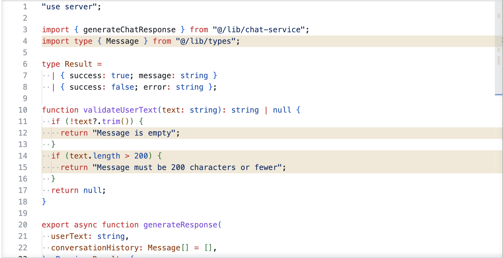
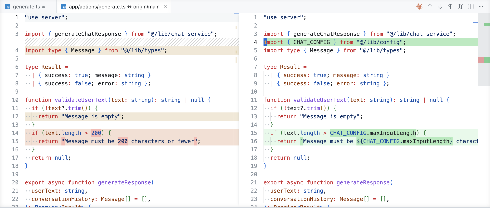
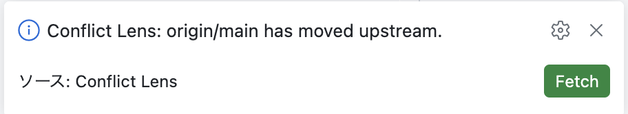
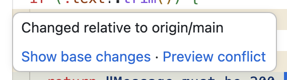
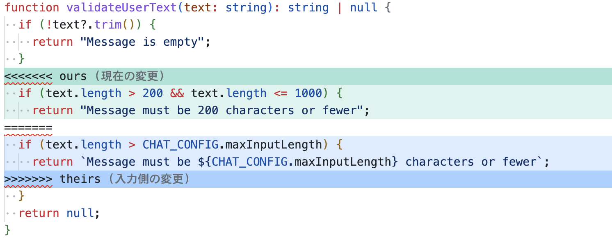

# Conflict Lens

English | [日本語](README.ja.md)

[](https://marketplace.visualstudio.com/items?itemName=Masa-Shin.conflict-lens)
[](https://github.com/Masa-Shin/conflict-lens/actions/workflows/ci.yml)
[](https://opensource.org/licenses/MIT)

A VS Code extension that highlights code where your edits could conflict with the base branch.

It periodically checks the remote base branch and highlights code in the file you have open that has been changed on the base branch.



You can also review the diff against the base branch on the spot.



- Catch conflict-prone code seamlessly while you work
- Spot clashes with other developers' changes before they happen
- Simulate the actual conflict to preview it

## Table of Contents

- [Features](#features)
- [Requirements](#requirements)
- [Installation](#installation)
- [Usage](#usage)
- [More Features](#more-features)
- [Configuration Reference](#configuration-reference)
- [Command Reference](#command-reference)
- [Troubleshooting](#troubleshooting)
- [Known Limitations](#known-limitations)
- [Development](#development)
- [License](#license)

## Features

### Visualizing changes on the base branch

It periodically checks the remote base branch and highlights any lines that have been changed upstream.

By default it runs `git ls-remote` every 5 minutes (or when you focus a file) to check for updates.
When an update is found, it shows a prompt to update the base branch (clicking OK runs `git fetch` for the base branch only).



You can also check the upstream changes from the hover menu on a highlighted line.



## Requirements

- VS Code 1.74 or later
- Git 2.30 or later

## Installation

### From the Marketplace

1. Open the Extensions view in VS Code (`Cmd`/`Ctrl` + `Shift` + `X`)
2. Search for "Conflict Lens"
3. Click Install

Or install from the command line:

```sh
code --install-extension Masa-Shin.conflict-lens
```

You can also open the [Marketplace page](https://marketplace.visualstudio.com/items?itemName=Masa-Shin.conflict-lens) directly.

> This is currently a pre-release. Use "Install Pre-Release Version" in the Extensions view to get the latest build.

## Usage

1. Open a git repository in VS Code
2. Click `Conflict Lens` in the bottom-right of the status bar and select a base branch (not needed if one is already selected)

This enables the features.

### About automatic base branch detection

When you install the extension, it auto-detects the base branch in the following order.

1. The remote's default branch (the target of `refs/remotes/<remoteName>/HEAD`)
2. `<remoteName>/main`
3. `<remoteName>/master`

If none is found, it shows `(no base)` and the features are disabled.

## More Features

### Viewing the list of changed files

Running `Conflict Lens: Show Changed Files` lists the files changed on the base branch at the top of the screen; selecting one opens that file.

### Viewing details in the diff editor

Compare the current content on the base branch with your local content side by side.

How to open:

- Click the "Show base changes" link in the hover menu on a highlighted line
- Run `Conflict Lens: Show Base Branch Changes` from the Command Palette

### Previewing the conflict

Preview the conflict that would occur in a separate tab. If there is no conflict, it notifies you with "No conflict."



How to open:

- Click the "Preview conflict" link in the hover menu on a highlighted line
- Run `Conflict Lens: Preview Conflict` from the Command Palette

### Temporarily disabling

`Conflict Lens: Toggle` switches the highlighting on and off.

## Configuration Reference

| Key | Default | Range | Description |
|---|---|---|---|
| `conflictLens.enabled` | `true` | bool | Turn the whole extension on/off |
| `conflictLens.remoteName` | `origin` | string | Remote name used for auto-detection |
| `conflictLens.showOverviewRuler` | `true` | bool | Show highlight positions on the scrollbar |
| `conflictLens.showFileDecorationBadges` | `true` | bool | Show badges in the Explorer |
| `conflictLens.remoteCheckIntervalMinutes` | `5` | 0-1440 | Interval for checking remote updates (minutes). `0` to disable |

You can override the highlight colors in `workbench.colorCustomizations` in your VS Code `settings.json`. The available keys are:

- `conflictLens.changedLineBackground` — background color for lines changed on the base (yellow by default)

## Command Reference

| Command | Description |
|---|---|
| `Conflict Lens: Enable` | Enable |
| `Conflict Lens: Disable` | Disable |
| `Conflict Lens: Toggle` | Toggle enabled/disabled |
| `Conflict Lens: Refresh` | Discard the cache and recompute |
| `Conflict Lens: Select Base Branch` | Select the base branch |
| `Conflict Lens: Show Changed Files` | List of changed files |
| `Conflict Lens: Show Base Branch Changes` | Show the diff between the current file and the base branch |
| `Conflict Lens: Preview Conflict` | Show the expected conflict in a read-only preview |
| `Conflict Lens: Show Output Channel` | Show the logs |


## Troubleshooting

You can check the logs with `Conflict Lens: Show Output Channel`.

**No highlights appear**

When the feature is halted, `Conflict Lens` in the status bar is shown with a strikethrough. Hover over the item to see the reason.

- Base branch not detected → specify one with `Select Base Branch`
- In the middle of a rebase or merge → finish or abort it
- Not on any branch (detached HEAD) → halted, since you rarely work in this state. Checking out a branch resumes it
- Git not found, or not a git repository

If there is no strikethrough but still no highlights, there may simply be no diff against the base. You can check with the following command.

```sh
git log --oneline HEAD...origin/main
```

**A setting change is not reflected**

Setting changes should apply immediately, but if something still seems off, try `Conflict Lens: Refresh`.

## Known Limitations

- In a multi-root workspace, only the first folder is watched
- Files inside submodules and symbolic links are not covered
- Very large files (over 15,000 lines or about 1.5M characters) are not highlighted

## Development

### Setting up the development environment

Running the following launches a separate VS Code window with the built extension loaded, so you can try it out.

```sh
npm run dev
```

## License

MIT
